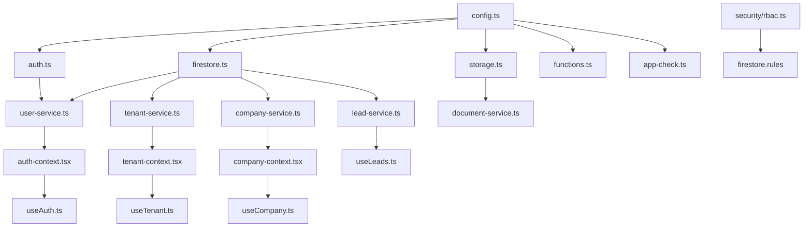

# Firebase Implementation: File Structure Plan

This document outlines all the files that need to be created or modified to implement the Firebase infrastructure as specified in the FIREBASE_IMPLEMENTATION_MASTERPLAN.md.

## Core Configuration Files

| File Path | Purpose | Key Contents |
|-----------|---------|--------------|
| `src/lib/firebase/config.ts` | Core Firebase configuration | Project credentials, initialization logic |
| `src/lib/firebase/app-check.ts` | App Check setup | reCAPTCHA configuration, app check activation |
| `.env.local` | Environment variables | Firebase credentials (API keys, project IDs) |
| `.env.development` | Development environment variables | Development Firebase project credentials |
| `.env.production` | Production environment variables | Production Firebase project credentials |
| `firebase.json` | Firebase project configuration | Hosting, functions, firestore settings |
| `firestore.rules` | Firestore security rules | Access control rules, validation logic |
| `firestore.indexes.json` | Firestore indexes | Query indexes configuration |
| `storage.rules` | Storage security rules | Access control for file storage |
| `functions/package.json` | Cloud Functions dependencies | Node.js dependencies for functions |

## Firebase Services

| File Path | Purpose | Key Contents |
|-----------|---------|--------------|
| `src/lib/firebase/auth.ts` | Authentication service | Sign-in, sign-up, custom claims management |
| `src/lib/firebase/firestore.ts` | Firestore database service | CRUD operations, batch operations, transactions |
| `src/lib/firebase/storage.ts` | Cloud Storage service | File upload/download, URL generation |
| `src/lib/firebase/functions.ts` | Cloud Functions client | Client-side function callers |
| `src/lib/firebase/messaging.ts` | Firebase Cloud Messaging | Push notification handling |
| `src/lib/firebase/analytics.ts` | Firebase Analytics | Event tracking, user properties |
| `src/lib/firebase/performance.ts` | Performance monitoring | Custom traces, performance metrics |
| `src/lib/firebase/app-check.ts` | App Check implementation | Security verification, bot protection |

## Data Services

| File Path | Purpose | Key Contents |
|-----------|---------|--------------|
| `src/lib/services/user-service.ts` | User management | User CRUD, role management |
| `src/lib/services/tenant-service.ts` | Tenant management | Tenant CRUD, settings management |
| `src/lib/services/company-service.ts` | Company management | Company CRUD, subscription management |
| `src/lib/services/lead-service.ts` | Lead management | Lead CRUD, assignment, scoring |
| `src/lib/services/customer-service.ts` | Customer management | Customer CRUD, relationship management |
| `src/lib/services/activity-service.ts` | Activity logging | Activity tracking, history management |
| `src/lib/services/document-service.ts` | Document management | File upload/download, metadata management |
| `src/lib/services/notification-service.ts` | Notification system | Send/track notifications |
| `src/lib/services/audit-service.ts` | Audit logging | Security audit trail |
| `src/lib/services/quota-service.ts` | Quota management | Usage tracking, limits enforcement |

## React Hooks

| File Path | Purpose | Key Contents |
|-----------|---------|--------------|
| `src/hooks/useAuth.ts` | Authentication hook | User authentication state, login/logout |
| `src/hooks/useUser.ts` | User data hook | Current user data and permissions |
| `src/hooks/useTenant.ts` | Tenant data hook | Current tenant and settings |
| `src/hooks/useCompany.ts` | Company data hook | Company data and subscription |
| `src/hooks/useLeads.ts` | Leads hook | Lead listing, filtering, CRUD |
| `src/hooks/useCustomers.ts` | Customers hook | Customer listing, filtering, CRUD |
| `src/hooks/useActivities.ts` | Activities hook | Activity feed, logging |
| `src/hooks/useNotifications.ts` | Notifications hook | Real-time notifications |
| `src/hooks/useDocuments.ts` | Documents hook | File management hooks |
| `src/hooks/useFirestoreQuery.ts` | Generic query hook | Reusable Firestore query hook |
| `src/hooks/useCache.ts` | Caching hook | Data caching utilities |

## Context Providers

| File Path | Purpose | Key Contents |
|-----------|---------|--------------|
| `src/lib/context/auth-context.tsx` | Authentication context | User auth state provider |
| `src/lib/context/tenant-context.tsx` | Tenant context | Current tenant provider |
| `src/lib/context/company-context.tsx` | Company context | Current company provider |
| `src/lib/context/notification-context.tsx` | Notification context | Real-time notifications |
| `src/lib/context/quota-context.tsx` | Quota context | Usage limits provider |
| `src/lib/context/theme-context.tsx` | Theme context | Tenant-specific theming |

## Cloud Functions

| File Path | Purpose | Key Contents |
|-----------|---------|--------------|
| `functions/src/index.ts` | Functions entry point | Function exports, initialization |
| `functions/src/auth/user-management.ts` | User management | User creation, deletion triggers |
| `functions/src/leads/lead-management.ts` | Lead management | Lead creation, assignment, scoring |
| `functions/src/analytics/metrics.ts` | Analytics functions | Usage metrics collection |
| `functions/src/webhooks/index.ts` | Webhook handlers | External API integration |
| `functions/src/scheduled/daily-jobs.ts` | Scheduled functions | Daily maintenance tasks |
| `functions/src/api/v1/index.ts` | API endpoints | HTTP function endpoints |
| `functions/src/middleware/rate-limiter.ts` | Rate limiting | API throttling |
| `functions/src/middleware/audit-logging.ts` | Audit logging | Request auditing |
| `functions/src/payments/stripe-webhooks.ts` | Payment processing | Subscription handling |

## Security & Encryption

| File Path | Purpose | Key Contents |
|-----------|---------|--------------|
| `src/lib/security/field-encryption.ts` | Field-level encryption | PII data protection |
| `src/lib/security/validation.ts` | Data validation | Input validation utilities |
| `src/lib/security/rbac.ts` | Role-based access | Permission checking utilities |
| `functions/src/security/key-management.ts` | Key management | Encryption key handling |

## Utilities

| File Path | Purpose | Key Contents |
|-----------|---------|--------------|
| `src/lib/utils/query-optimizer.ts` | Query optimization | Performance tracking |
| `src/lib/utils/firestore-cache.ts` | Caching implementation | Client-side cache management |
| `src/lib/utils/batch-processor.ts` | Batch operations | Process large data sets |
| `src/lib/utils/tenant-isolation.ts` | Multi-tenant utilities | Tenant data isolation |
| `scripts/deploy.js` | Deployment script | Environment-specific deployment |
| `scripts/backup-firestore.js` | Backup script | Database backup utility |
| `scripts/generate-firestore-indexes.js` | Index generation | Create indexes from queries |

## Testing

| File Path | Purpose | Key Contents |
|-----------|---------|--------------|
| `src/__tests__/security/firestore-rules.test.ts` | Security rules testing | Rule validation tests |
| `src/__tests__/services/user-service.test.ts` | User service tests | User CRUD testing |
| `src/__tests__/services/lead-service.test.ts` | Lead service tests | Lead functionality testing |
| `src/__tests__/hooks/useAuth.test.ts` | Auth hook tests | Authentication testing |
| `src/__tests__/security/tenant-isolation.test.ts` | Isolation tests | Multi-tenant boundary tests |
| `cypress/e2e/auth-flows.cy.ts` | E2E auth testing | User authentication flows |
| `cypress/e2e/lead-management.cy.ts` | E2E lead testing | Lead management flows |

## Implementation Steps

### Phase 1: Foundation
1. Set up core configuration files
2. Implement basic Firebase services
3. Create authentication context and hooks
4. Set up security rules

### Phase 2: Data Services
1. Implement data services for core entities
2. Create React hooks for data access
3. Set up context providers
4. Implement basic Cloud Functions

### Phase 3: Advanced Features
1. Implement field-level encryption
2. Set up caching strategy
3. Create audit logging system
4. Implement rate limiting and quotas

### Phase 4: Testing & Optimization
1. Develop test suites for all components
2. Implement query optimization
3. Set up performance monitoring
4. Create deployment scripts

### Phase 5: Operations & Maintenance
1. Create backup and recovery scripts
2. Set up monitoring and alerting
3. Implement database maintenance procedures
4. Document all components

## File Dependency Graph

