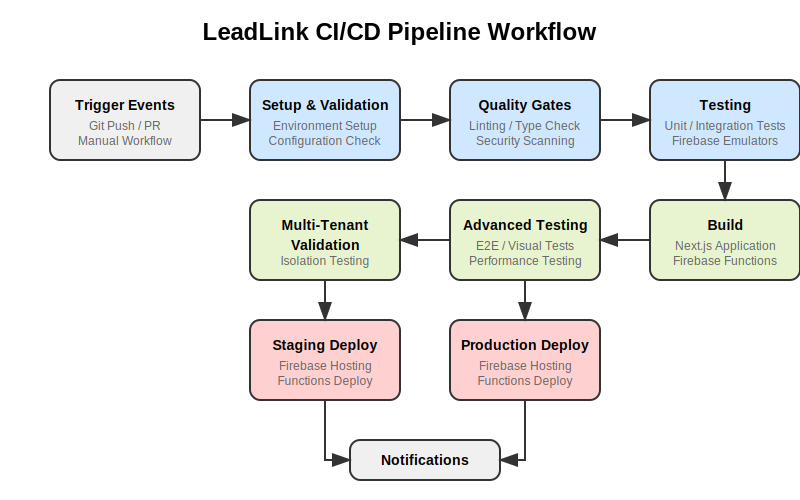

# LeadLink CI/CD Pipeline Documentation

This document provides detailed information about the Continuous Integration and Continuous Deployment (CI/CD) pipeline for the LeadLink CRM project.

## Overview

The LeadLink CI/CD pipeline automates the building, testing, and deployment processes, ensuring high-quality code and reliable deployments. It is implemented using GitHub Actions and integrates with Firebase hosting and functions.

## Pipeline Workflow



The pipeline consists of the following key stages:

1. **Setup & Validation**: Prepares the environment and validates configuration
2. **Code Quality**: Linting, type checking, and code formatting
3. **Security Testing**: Security audits and Firebase security rules validation
4. **Unit & Integration Tests**: Runs unit tests and integration tests with Firebase emulators
5. **Build Application**: Builds the Next.js application
6. **End-to-End Testing**: Runs browser-based tests using Playwright
7. **Multi-Tenant Validation**: Tests the multi-tenant isolation features
8. **Deployment**: Deploys to the appropriate environment (staging or production)
9. **Notification**: Sends notifications about deployment status

## Supported Triggers

The pipeline can be triggered in the following ways:

- **Push to branches**: Automatically runs on pushes to `main`, `development`, and any `feature/*` or `hotfix/*` branches
- **Pull Requests**: Runs when PRs are opened or updated against `main` or `development`
- **Manual Trigger**: Can be manually triggered via GitHub Actions UI with environment selection

## Environments

The pipeline supports the following environments:

| Environment | Trigger | URL |
|-------------|---------|-----|
| Development | Push to feature branches | N/A (Local only) |
| Staging | Push to `development` branch or manual selection | https://staging.leadlink-crm.com |
| Production | Push to `main` branch or manual selection | https://leadlink-crm.com |

## Required Secrets

The pipeline requires the following secrets to be configured in GitHub:

| Secret Name | Description |
|-------------|-------------|
| `FIREBASE_API_KEY` | Firebase API key |
| `FIREBASE_AUTH_DOMAIN` | Firebase auth domain |
| `FIREBASE_PROJECT_ID` | Firebase project ID |
| `FIREBASE_STORAGE_BUCKET` | Firebase storage bucket |
| `FIREBASE_MESSAGING_SENDER_ID` | Firebase messaging sender ID |
| `FIREBASE_APP_ID` | Firebase app ID |
| `FIREBASE_SERVICE_ACCOUNT` | Firebase service account JSON (for deployment) |
| `DEPLOYMENT_WEBHOOK_URL` | Webhook URL for deployment notifications |
| `SLACK_WEBHOOK_URL` | Slack webhook URL for notifications |

## Test Suites

The pipeline runs several types of tests:

### 1. Unit Tests

Unit tests are run with Jest and focus on testing individual components and functions in isolation.

```bash
npm run test:unit
```

### 2. Integration Tests

Integration tests validate the interaction between different parts of the application, including Firebase services.

```bash
npm run test:integration
```

### 3. End-to-End Tests

E2E tests use Playwright to test the application in a real browser environment.

```bash
npm run test:e2e
```

### 4. Security Tests

Security tests validate Firebase security rules and perform security audits.

```bash
npm run test:firestore
```

### 5. Multi-Tenant Validation Tests

These tests specifically validate the multi-tenant isolation features of the application.

```bash
npm run validate:multitenant
```

### 6. Visual Regression Tests

Visual tests compare screenshots of UI components to detect unintended visual changes.

```bash
npm run test:visual
```

### 7. Performance Tests

Performance tests measure application performance metrics.

```bash
npm run test:performance
```

## Caching Strategy

The pipeline uses GitHub Actions caching for:

- Node modules (`node_modules`)
- Next.js build output (`.next`)
- Playwright browsers

This significantly reduces build times for subsequent runs.

## Deployment Process

### Staging Deployment

When deploying to staging:

1. Builds the application with staging environment variables
2. Authenticates with Google Cloud using the service account
3. Deploys Firebase functions
4. Deploys to the Firebase hosting staging target
5. Records the deployment in the deployment history

### Production Deployment

Production deployment follows the same steps as staging but includes additional safeguards:

1. Requires all tests to pass, including performance and visual tests
2. Deploys to the production Firebase hosting target
3. Creates a Git tag with the version number
4. Records the deployment in the deployment history

## Local Development

Developers can run the same pipeline locally to ensure their changes will pass in the CI/CD pipeline:

```bash
# Run linting and type checking
npm run lint

# Run unit and integration tests
npm run test:unit
npm run test:integration

# Run E2E tests (requires the app to be built first)
npm run build
npm run test:e2e
```

## Deployment to Firebase Locally

Developers can deploy to Firebase manually using the Firebase CLI:

```bash
# Deploy to staging
npm run deploy:staging

# Deploy to production
npm run deploy:prod
```

## Handling Failures

If the pipeline fails at any stage:

1. Check the GitHub Actions logs for the specific error
2. Fix the issues in your branch
3. Push the changes, which will trigger a new pipeline run

## Monitoring Deployments

Deployments can be monitored via:

- GitHub Actions dashboard
- Firebase Console
- Slack notifications (if configured)

## Best Practices

1. **Small, Focused PRs**: Keep pull requests small and focused on a single feature or bug fix
2. **Write Tests**: Include tests for new features and bug fixes
3. **Run Tests Locally**: Run tests locally before pushing to save time and resources
4. **Review Deployment Logs**: Always check deployment logs for warnings or errors
5. **Use Feature Branches**: Develop new features in dedicated feature branches
6. **Keep Dependencies Updated**: Regularly update dependencies to minimize security risks

## Customizing the Pipeline

To customize the CI/CD pipeline:

1. Edit the `.github/workflows/ci.yml` file
2. Commit and push the changes
3. The updated pipeline will be used for subsequent runs

## Troubleshooting

### Common Issues

1. **Test Failures**: Check test logs for specific error messages
2. **Build Failures**: Verify that all dependencies are installed and compatible
3. **Deployment Failures**: Ensure Firebase configuration is correct and service account has necessary permissions
4. **Timeout Issues**: Consider splitting large test suites or increasing the timeout limit

### Getting Help

For issues with the CI/CD pipeline, contact:

- The DevOps team via Slack (`#devops-support`)
- File an issue in the internal issue tracker with the label `ci-cd`

## Future Improvements

Planned improvements for the CI/CD pipeline:

1. Add automatic dependency updates with Dependabot
2. Implement more detailed test reporting
3. Add code coverage requirements
4. Implement blue/green deployment for zero-downtime updates
5. Add infrastructure-as-code for pipeline configuration

## Changelog

| Date | Version | Description |
|------|---------|-------------|
| July 30, 2023 | 1.0.0 | Initial implementation of comprehensive CI/CD pipeline |

## References

- [GitHub Actions Documentation](https://docs.github.com/en/actions)
- [Firebase CLI Documentation](https://firebase.google.com/docs/cli)
- [Next.js Deployment Documentation](https://nextjs.org/docs/deployment)
- [Playwright Testing Documentation](https://playwright.dev/docs/intro) 